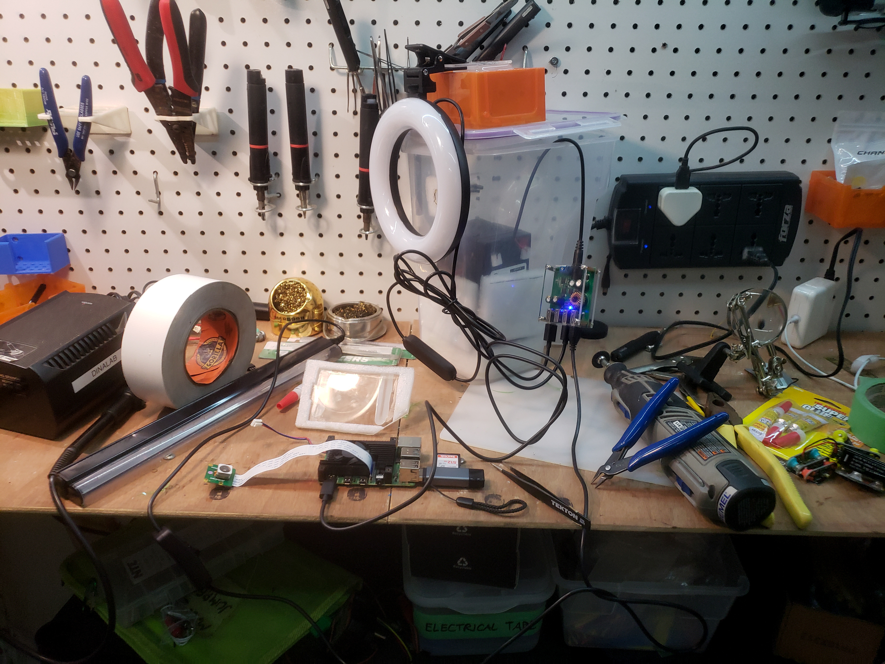

```{r setup, include=FALSE}
knitr::opts_chunk$set(echo = FALSE)
```

We are developing an automated light trap that attracts moths and other insects at night and uses computer vision to automatically take photos, crop out insects, and identify them. Though this will not be ready for mass-deployment for a while yet, it will be a non-invasive, automated, direct method of documenting the incredible insect diversity of reforestation and conservation sites.

Still working on this page...


