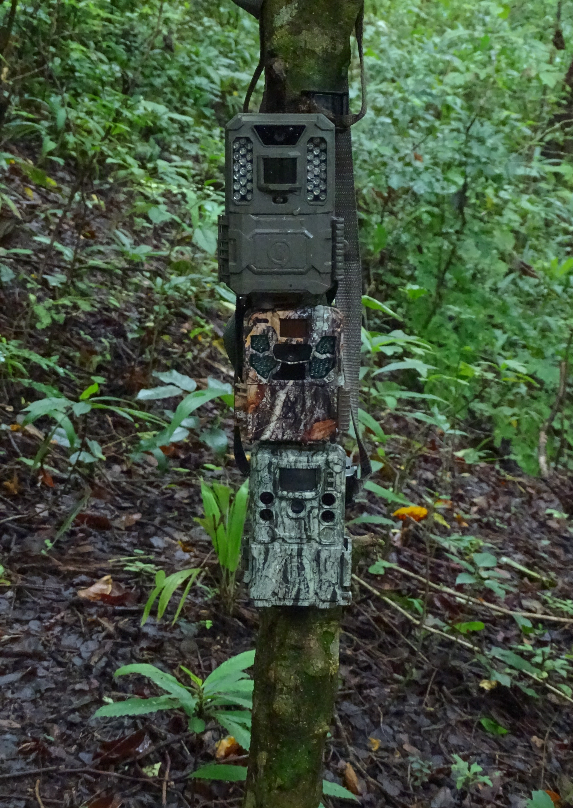
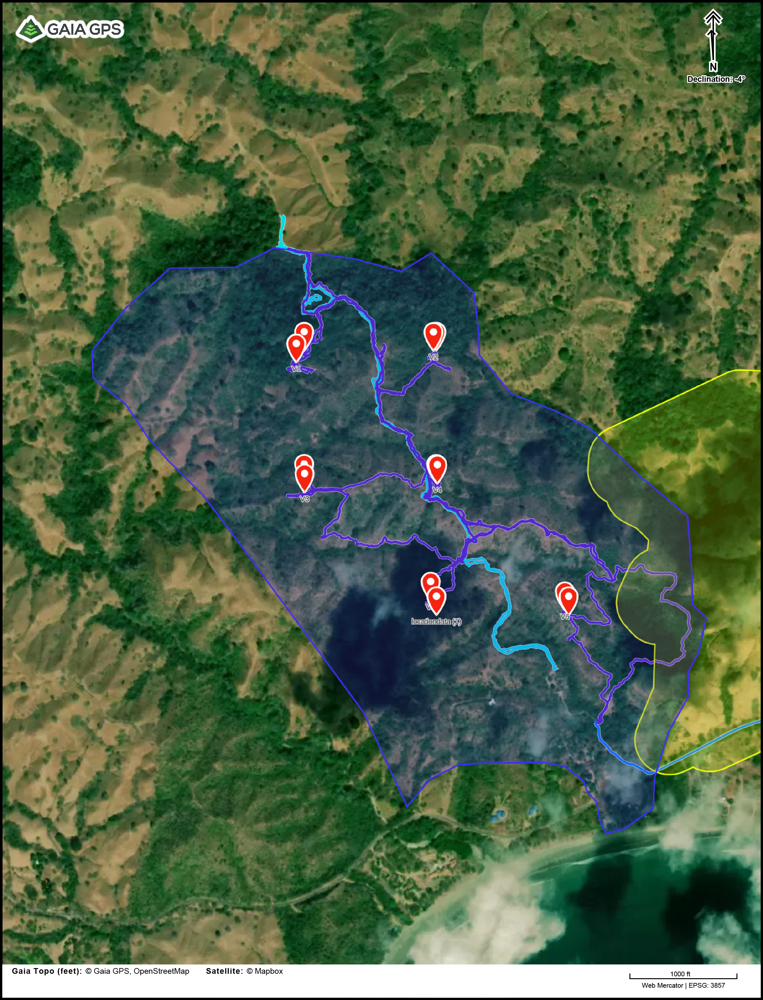
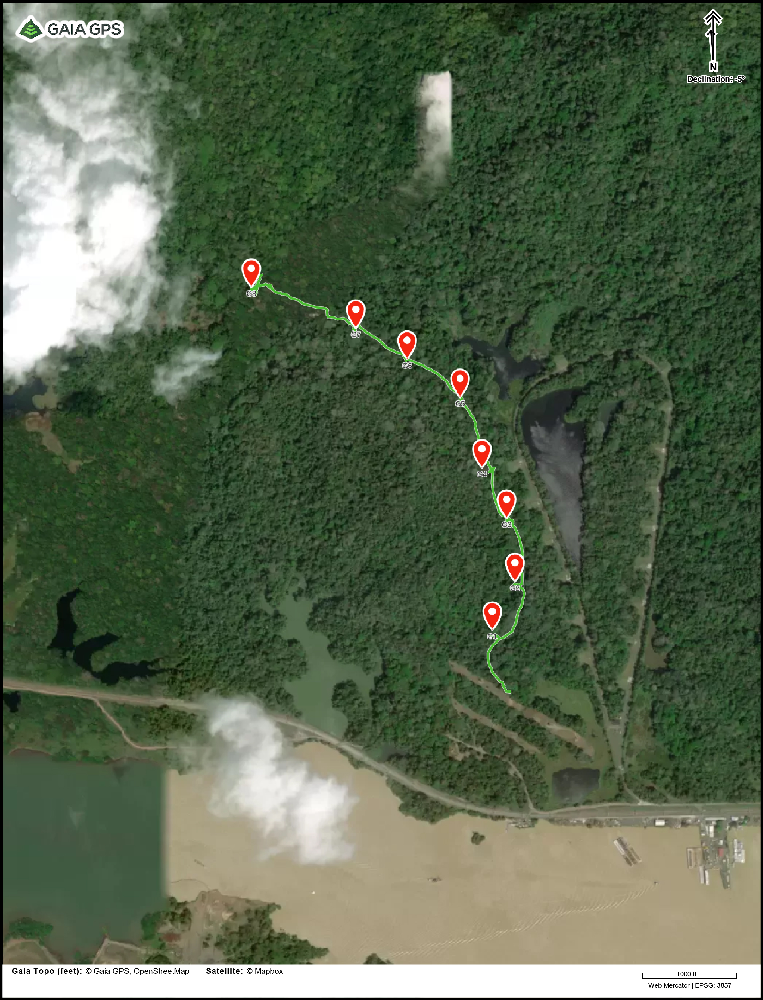
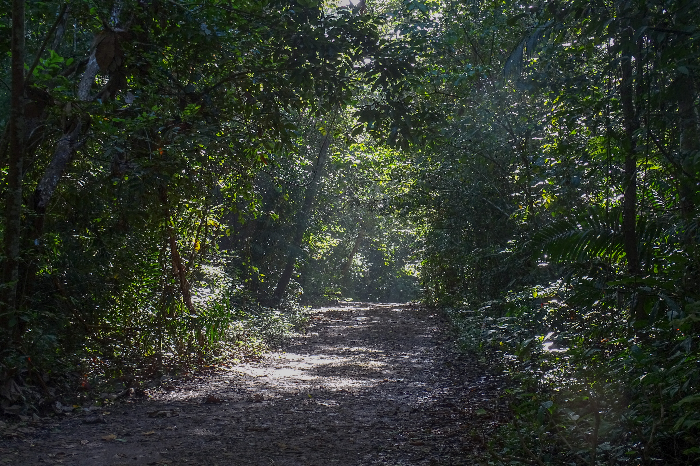
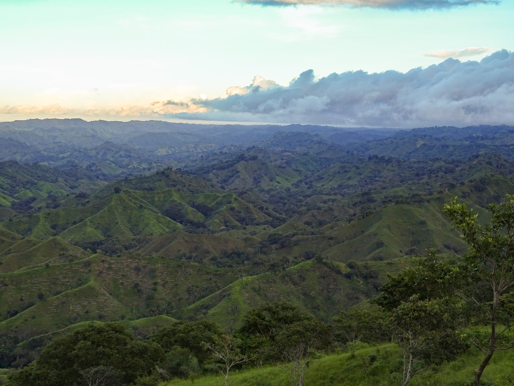
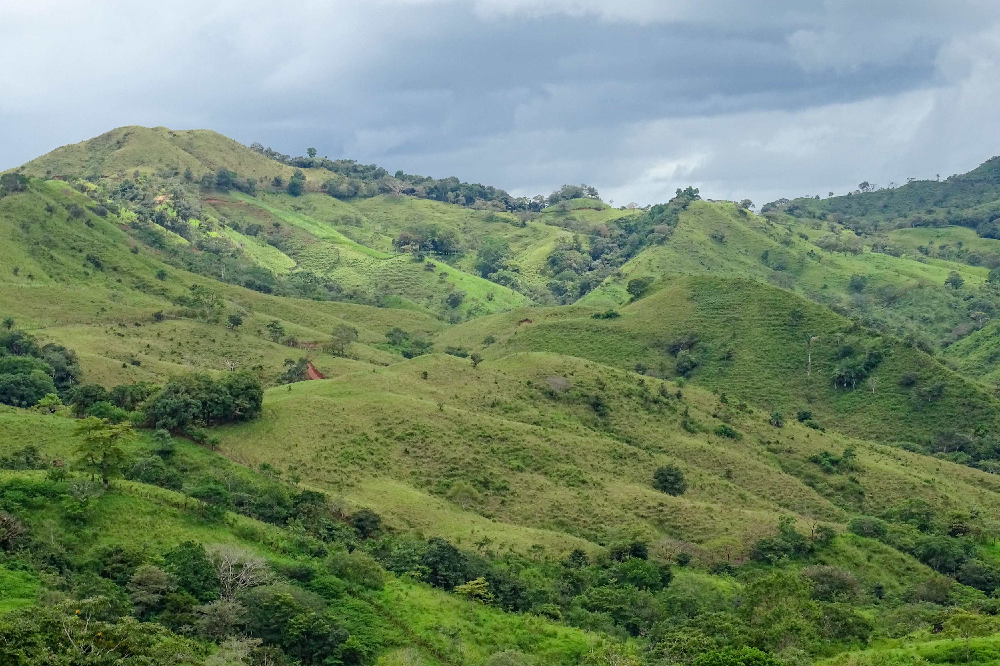
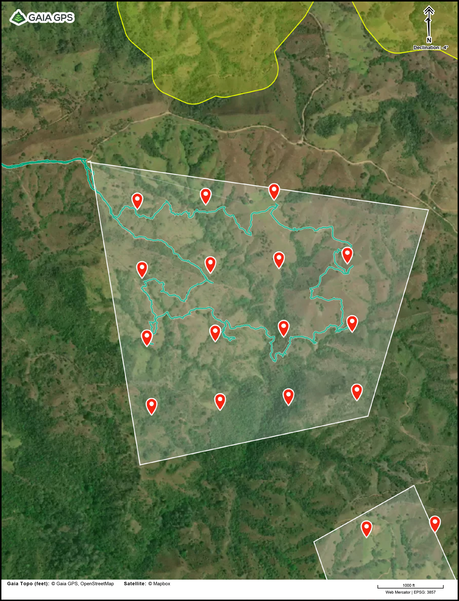

```{r setup, include=FALSE}
knitr::opts_chunk$set(echo = FALSE)
```

Walking through a tropical forest you are likely to miss 80% of the animals living there. You will be seen and heard long before you could be aware of them, and many only move around at night. Camera traps are a great tool for gaining an understanding of this hidden diversity. These weather-proofed cameras automatically take photos when they detect motion, day and night. They can be left with no maintenance to collect photos without disturbing wildlife for months, depending on conditions and camera settings.


<p>&nbsp;</p>
One of the best ways to get an understanding of the richness of mammal species, and to be able to say something about abundance and density of animal populations in a given area, is a grid of many cameras deployed for at least a month. Arranging cameras in a grid, instead of easy to reach places or at targeted sites where animals are more densely concentrated, allows objective comparison between projects and through time. This approach and the ensuing analysis of the camera trap data, is called the Random Encounter Model (REM). This is the most widely-used approach to collect richness, detection rate, and data that can be used to model occupancy for medium and to large mammals species.

### Eco Venao
As a part of the November 2022 Pilot Study at the Azuero Project I was testing three different models of camera trap, four different battery types, two different security measures, and the difficulty of navigating the terrain to get to pre-defined GPS points of a camera grid. The first test involved setting up 8 cameras at Eco Venao. This area was chosen because it is easy to access, has trails, has forest (including a section of 80+ year old forest), and is among the best sites of the Azuero Project in terms of biodiversity, based on a quick subjective assessment. 

{width=115%}

Most days I had fieldwork at Venao I saw Howler monkeys, and every day I could hear them call in the distance at least once. At one point I saw a family of Coatis, and even the print of a small cat (maybe a jagarundi?). The forest was obviously not as rich as Soberania National Park near Gamboa, where I have done most of my Panamanian fieldwork int he past, however I was optimistic that the cameras would pick up something cool.

After 11 nights out in the field the only animals that the camera picked up other than horses released for grazing and a couple of humans were a bird and a deer. 

Can you spot them in the photos?:

```{r, echo=FALSE, message = FALSE, warning = FALSE}
library(pixture)

venao.cams <- c("media/camera.traps/11200013.JPG",
                "media/camera.traps/IMG_0057.JPG")
pixgallery(venao.cams)
```

A disappointing result. 

Hint on finding the deer: look at the very right edge. Yes, this is the best photo I got of him.

### Gamboa (Pipeline Road in Soberania)

To confirm that the camera traps and techniques for affixing them to trees work, I decided to test out the cameras off of Pipeline Road in Soberania National Park, near Gamboa. 

I did not have time to set cameras out on a truly random grid, but to provide a sense of random distribution I positioned cameras 200 meters apart, 20 meters from the road along the beginning of Pipeline Road.



While setting the cameras I knew that these would be more fruitful. For one, a couple of the locations were near fruiting palms and figs, which attract many animals. Others fell near animal trails of one kind or another, and there were tracks virtually everywhere.




When I collected the cameras, after only four nights out, the results were striking. Every camera picked up an abundance of animals. Agoutis were the most abundant, as was expected - they're even common in Gamboa town. Other smaller animals including coati and armadillo were present, though there were a number of larger animals that are targeted buy hunters as well. I was surprised by the number of peccary and deer the camera traps caught so close to the road and near the edge of the forest. The highlight from the traps however was an ocelot, a clear sign of a healthy lowland neotropical forest. 

```{r, echo=FALSE, message = FALSE, warning = FALSE}
gamboa.cams <- c("media/camera.traps/12040081.JPG",
           "media/camera.traps/IMG_0035.JPG",
           "media/camera.traps/IMG_0066.JPG",
           "media/camera.traps/IMG_0086.JPG",
           "media/camera.traps/IMG_0092.JPG",
           "media/camera.traps/IMG_0156.JPG")

pixgallery(gamboa.cams)
```


This great diversity gives a glimpse of what the Azuero Peninsula could look like after Earthshot restores the landscape. 

The forest where I set my cameras is ~80 year old natural regeneration. There is still poaching pressure here, though it tends to be restricted to the difficult to  access depths of the park where there is no one to enforce protection. Perhaps more importantly it is connected to old growth areas and is quite large and contiguous, part of the green belt on either side of the Panama Canal. When Earthshot connects Cerro Hoya to the rest of the Azuero Peninsula via the spider monkey corridor perhaps we can see such diversity return. It will be a gradual process, giving animals space to exist and humans opportunities that discourage poaching, though I expect we should see diversity building even before that level of connectivity is reached.



### Galindo Morales Land

Another important test I ran during the November 2022 Pilot Study was how much effort it would require to place the required number of cameras across a reforestation landscape. Eco Venao is a small area, already mostly forested, in the lowlands, and easy to access, so it is not representative of the majority of land Earthshot will restore. Experts at Pro Eco Azuero said that the land of Galindo Morales is a top priority for planting next year, and representative of the lands Earthshot will restore. It is composed of several relatively large (100+ ha) land parcels at around 300 m elevation. Very hilly landscape composed of grassy cattle pasture interspersed with forested gullies.




I created a grid of simulated camera coordinates on one of the land parcels and had a goal to just hike to as many as I could to get a feel for the terrain and effort required for setting cameras. I had a full backpack to stimulate carrying cameras, and carried a few metal stakes that cameras would be attached to if there was no suitable tree near the camera placement point. 


It turned out that I couldn't drive all the way to the entrance due to a very muddy road (this won't be an issue in the dry season, though good to know for the wet season sampling next July), and the terrain was very difficult to traverse, especially steep gullies that do not register on topographic maps. In 6 hours of bushwhacking I placed 10 cameras. Those numbers could potentially have been boosted if local people (ranch hands, fence builders, ect.) who know the land help navigate.


Some sights on the Morales plot:

```{r, echo=FALSE, message = FALSE, warning = FALSE}
morales.pics <- c("media/gallery/DSC00968.jpg",
           "media/gallery/DSC00866.jpg",
           "media/gallery/DSC00953.jpg",
           "media/gallery/DSC00906.jpg",
           "media/gallery/DSC00946.jpg",
           "media/gallery/DSC00915.jpg")

pixgallery(morales.pics)
```
